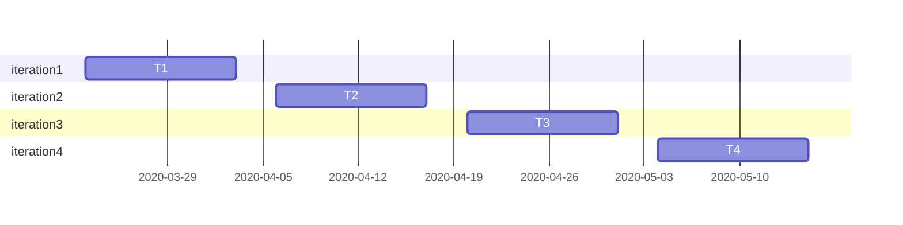

# Totoro Ramen 

Totoro Ramen is a software of a selfservice mkiosk for a ramen restaurant in order to reduce the customers waiting.  
  


## Requirement - 需求
* Java 11 or above
* Eclipse


## Features - 特点
#### For customer
* order set meal of ramen
* customize ingredients based on your taste
* register to have loyalty service
* pay in diffrent ways
#### For administrator
* login & logout
* retrieve password
* modify the price of ingredients
* check ingredients inventories
* check sales in the past week


## Schedule - 时间表



##  Architecture - 架构


```
graph TD
Group_98-->lib
Group_98-->src

lib-->jxl.jar
lib-->jfreechart.jar
lib-->jcommon.jar

src-->code
src-->img
src-->xls

code-->Startup.java
code-->...

xls-->inventory.xls
xls-->order.xls
xls-->user.xls

```
  


## Usage - 用法
**Startup** is a module that allows you to start using this software. To start the software, you only need to open this project in eclipse, enter the path *Group_98/src/code* and ++run++ this class.  


class | function
---|---
Startup     | initial menu to choose customer or administrator
Ramen     | the entity of set meal of ramen
AddRamen | customer's home menu
AddOn | customize ingredients of the meal
ModifyOrder | customers check shopping cart
UserRegister & UserPwdQuestion | register new member
UserLogin | members login
UserForgetPwd & UserReset | members reset their password based on security questions
Pay | check the total price
PayFinish | choose a way to pay
AdmForgetPwd & AdmReset | administrators reset their accounts
AdmFunction | administrators choose the function they want
AdmModify | administrators modify the price of ingredients and check inventories
BarChart | check sales in the past week
ExcelHandler | all the operations involves with excel


## Visuals - 视觉效果
  

  

  

  


## Lisense - 开源协议
MIT
